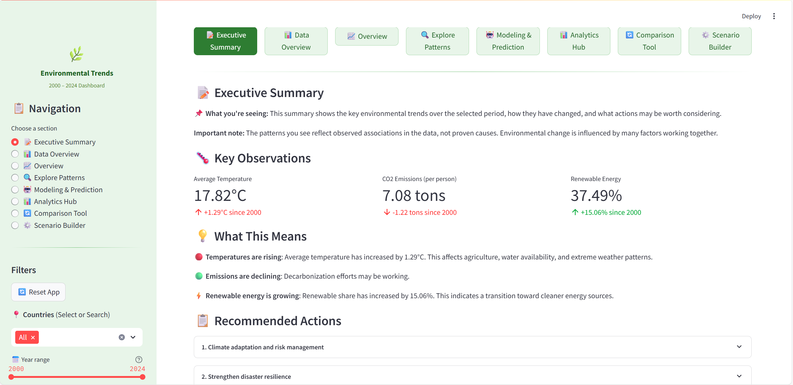
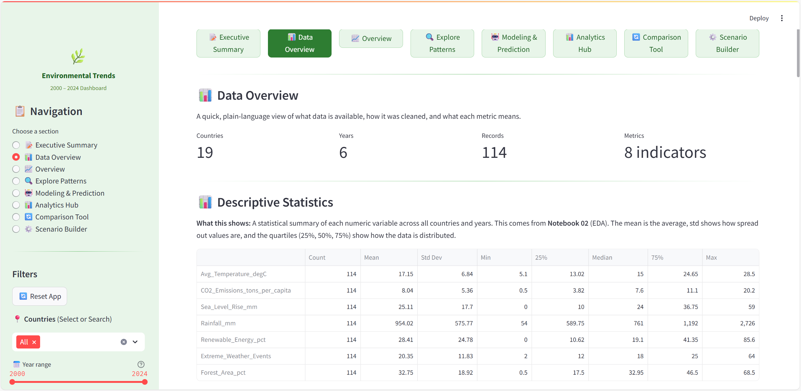
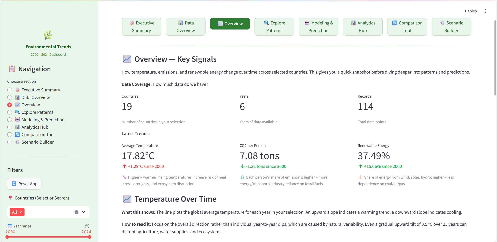
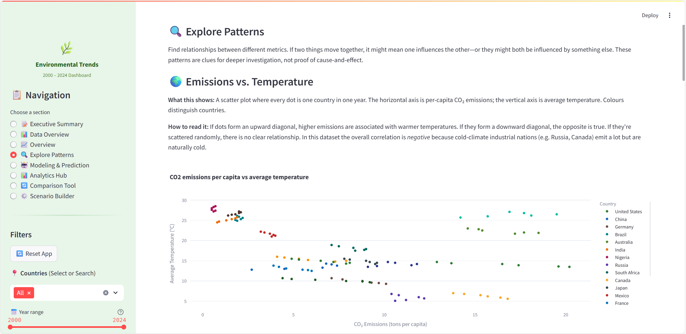
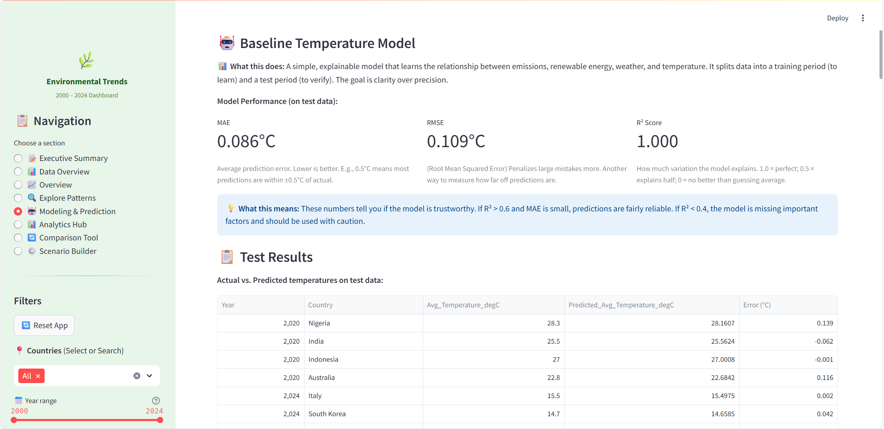
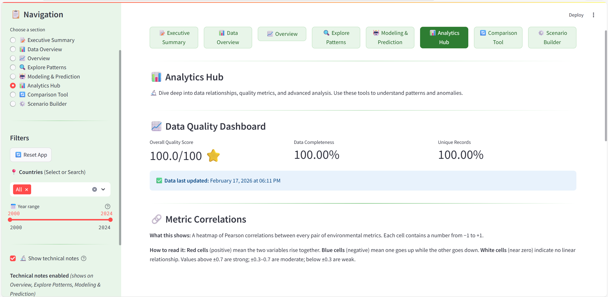
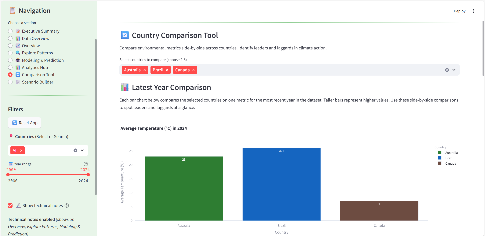
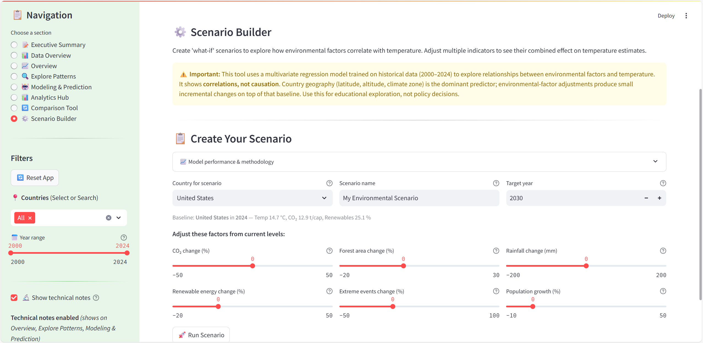

# Global Environmental Trends (2000–2024)

## Table of Contents

1. [Project Overview](#project-overview)
2. [Dataset Content](#dataset-content)
3. [Business Requirements](#business-requirements)
4. [Hypothesis and How to Validate](#hypothesis-and-how-to-validate)
5. [Rationale: Business Requirements → Data Visualisations](#the-rationale-to-map-the-business-requirements-to-the-data-visualisations)
6. [Dashboard Design](#dashboard-design)
7. [Project Hypothesis and Validation](#project-hypothesis-and-validation)
8. [Data Ethics and Privacy](#data-ethics-and-privacy)
9. [Project Structure](#project-structure)
10. [Methodology and Workflow](#methodology-and-workflow)
11. [Unfixed Bugs](#unfixed-bugs)
12. [Prerequisites](#prerequisites)
13. [Running the Dashboard Locally](#running-the-dashboard-locally)
14. [Deployment](#deployment)
15. [Main Data Analysis and Libraries](#main-data-analysis-and-libraries)
16. [Credits](#credits)
17. [Acknowledgements](#acknowledgements)

---

## Project Overview

This capstone project demonstrates comprehensive data analytics skills applied to environmental climate data. The project covers the complete data analytics lifecycle: from business understanding and data quality assessment, through exploratory analysis and hypothesis testing, to predictive modeling and interactive dashboard deployment.

**Key Deliverables:**
- ✅ Business requirements analysis with stakeholder-driven user stories
- ✅ Complete data pipeline: 4 Jupyter notebooks (ingestion → EDA → hypothesis testing → modeling)
- ✅ Statistical analysis: 4 hypotheses tested with correlation studies and trend analysis
- ✅ Predictive modeling: Per-country Year→Temperature linear regression with performance metrics (MAE, RMSE, R²) and 95% bootstrap confidence intervals
- ✅ Interactive dashboard: 8-page Streamlit application with icon-based quick navigation, descriptive statistics, hypothesis summary table, confidence interval charts, and scenario modeling
- ✅ Data ethics framework: Comprehensive privacy, bias, and responsible AI documentation
- ✅ Deployment-ready: Configured for Heroku with all dependencies specified

**Learning Outcomes Demonstrated:**
1. **Business Understanding:** Clear requirements, user stories, and stakeholder needs
2. **Data Collection & Quality:** Data ingestion, validation, and quality assessment
3. **Exploratory Analysis:** Descriptive statistics, visualizations, and pattern discovery
4. **Statistical Testing:** Hypothesis formulation, correlation analysis, and interpretation
5. **Predictive Modeling:** Feature engineering, model training, evaluation, and forecasting
6. **Communication:** Plain-language explanations, interactive dashboard, comprehensive documentation
7. **Ethics & Privacy:** Data governance, bias acknowledgment, responsible AI principles

## Dataset Content

* The dataset is sourced from [Kaggle](https://www.kaggle.com/datasets/adilshamim8/temperature). We created a user story in which data analytics can be applied in a real project in the workplace.
* The dataset has 156 rows (114 after duplicate removal) and represents environmental records from 19 countries across the globe. It covers 8 environmental indicators (temperature, CO₂ emissions, sea level rise, rainfall, population, renewable energy, extreme weather events, forest coverage) and their respective values collected at 5-year intervals from 2000 to 2024.
* **Note:** The dataset contains some duplicate country-year combinations (42 duplicate entries for 7 countries: Australia, Brazil, China, Germany, India, Nigeria, Russia). These duplicates were present in the original source data and represent different measurement records for the same country and year.

|Variable|Meaning|Units|
|:----|:----|:----|
|Year|Year of observation|2000, 2005, 2010, 2015, 2020, 2024|
|Country|Country name|19 countries including United States, China, Germany, Brazil, Australia, India, Nigeria, Russia, Japan, Canada, Mexico, France, Indonesia, United Kingdom, Spain, South Korea, Italy, Saudi Arabia, South Africa|
|Avg_Temperature_degC|Average temperature in degrees Celsius|5.1 - 28.5|
|CO2_Emissions_tons_per_capita|Per-capita CO2 emissions in metric tons|0.5 - 20.2|
|Sea_Level_Rise_mm|Sea level rise in millimeters|0 - 59|
|Rainfall_mm|Annual rainfall in millimeters|54 - 2726|
|Population|Total population|19153000 - 1426000000|
|Renewable_Energy_pct|Percentage of energy from renewable sources|0 - 87.2|
|Extreme_Weather_Events|Count of extreme weather events reported|2 - 64|
|Forest_Area_pct|Forest area as percentage of total land area|0.5 - 68.5|

## Business Requirements

As a data analyst, environmental stakeholders and policy teams have asked you to help understand global environmental trends. They want insights to support awareness and planning for climate action.

Stakeholders have raw environmental data, but they need clear visualizations and easy-to-understand insights. They want to see how different environmental indicators connect to each other and what future trends might look like. They need to see patterns across countries and time periods to make better decisions.

* 1—The client is interested in discovering how environmental indicators correlate with each other. Therefore, the client expects data visualizations of the correlated variables to show these relationships clearly.
* 2—The client is interested in predicting future temperature trends to support planning and risk assessment for the next 3-5 years.

## Hypothesis and how to validate

* Using environmental science knowledge, here are my hypothesis(es):
* 1: We suspect that higher CO2 emissions per person are linked to higher average temperature. Note: This shows a connection, not a cause-and-effect relationship, because climate zones and development levels are different in each country.
	* How to validate: We will conduct a correlation study (Pearson and Spearman) to measure how strongly CO2 emissions and temperature are related.
* 2: We suspect that higher renewable energy use is linked to lower or steadier CO2 emissions per person.
	* How to validate: We will conduct a correlation study to examine the relationship between renewable energy and CO2 emissions. A negative correlation (when one goes up, the other goes down) would support this idea.
* 3: We suspect that extreme weather events have increased over time from 2000 to 2024.
	* How to validate: We will analyze the time trend of extreme weather events using line charts. We will calculate how much the number of events changed between 2000 and 2024. We will also use regression analysis to test if the trend is statistically significant.
* 4: We suspect that higher forest area is linked to fewer extreme weather events.
	* How to validate: We will conduct a correlation study to examine the relationship between forest area and extreme weather events. Note: This connection may be weak because forest coverage alone doesn't strongly predict weather events at the country level.

## The rationale to map the business requirements to the Data Visualisations

* **Business Requirement 1:** Data Visualisation and Correlation study
	* As a client, I want to inspect the data related to environmental records so that I can discover how environmental indicators correlate with each other.
	* As a client, I want to conduct a correlation study (Pearson and Spearman) to understand better how the variables are correlated to temperature and other key metrics so that I can discover meaningful relationships.
	* As a client, I want to plot the main variables against each other to visualize insights and discover how environmental indicators relate to climate trends.

* **Business Requirement 2:** Temperature Trend Prediction
	* As a client, I want to see predicted temperature trends for the next 3-5 years so that I can plan for climate risks and adaptation strategies.
	* As a client, I want to understand the model's accuracy metrics (MAE, RMSE, R²) so that I can assess the reliability of the predictions.
	* As a client, I want to see visualizations comparing actual historical data with predictions so that I can evaluate the model's performance.

## Dashboard Design

The dashboard is built with **Streamlit**, chosen over Tableau and Power BI because it is a free, open-source Python framework that allows the entire analytics pipeline; data processing, statistical testing, machine learning, and interactive visualisation to live in a single codebase. Therefore, making it easy to deploy as a standalone web app on Heroku without requiring users to install any software or hold a paid licence.

### Global Quick-Navigation Bar
* A persistent icon-based navigation bar appears at the top of every page
* 8 buttons with descriptive icons (📝 📊 📈 🔍 🤖 📊 🔄 ⚙️) allow one-click access to any page
* The active page is visually highlighted for orientation
* Complements the sidebar navigation for faster page switching

### Page 1: 📝 Executive Summary
* Quick project summary and key findings
	* Overview of the project's purpose and goals
	* Key observations section showing:
		* Average temperature change over the selected period
		* CO2 emissions per capita change
		* Renewable energy percentage change
	* Plain-language interpretation section explaining what these trends mean in practical terms
	* Recommended actions based on observed trends (climate adaptation, emissions reduction, renewable energy growth, etc.)
	* Country-specific findings table showing which countries face the greatest challenges or have made the strongest progress
	* Status indicators (red/yellow/green) to highlight urgent attention areas



### Page 2: 📊 Data Overview
* Data overview, quality assessment, and exploratory statistics
	* Summary metrics: number of countries, years covered, total records, and indicators tracked
	* **Descriptive statistics table** showing count, mean, std, min, quartiles, and max for all numeric variables
	* **Interactive histograms** for all 7 numeric variables (temperature, CO₂, sea level, rainfall, population, renewable energy, extreme weather) with explanatory captions
	* **Box plots by country** for 4 key metrics (temperature, CO₂ emissions, renewable energy, extreme weather) showing distribution spread across nations
	* Data quality assessment showing missing values, duplicate rows, and data integrity status
	* Cleaning steps applied (duplicates removed, missing values handled, type/range validation)
	* Key fields glossary with definitions and context for each metric
	* Sample data table showing the first 10 records from the dataset
	* Download options for full dataset, data glossary, and quality report in CSV format



### Page 3: 📈 Overview
* Key signals and trends
	* Data coverage metrics (countries, years, records)
	* Latest trends showing:
		* Average temperature with change indicator
		* CO2 per person with change indicator
		* Renewable energy percentage with change indicator
	* Plain-language captions explaining what each metric means
	* Temperature over time line chart with explanatory caption
	* Extreme weather events bar chart showing top 10 countries in the latest year with explanatory caption
	* Quick insights section highlighting:
		* Countries with biggest temperature increases
		* Countries with highest renewable energy growth
		* Overall trends summary
	* All charts include 💡 interpretation captions to help non-technical users



### Page 4: 🔍 Explore Patterns
* Correlation and relationship analysis
	* Scatter plots showing:
		* CO2 emissions vs. average temperature
		* Renewable energy vs. CO2 emissions
		* Forest area vs. extreme weather events
		* Rainfall vs. temperature
	* Each plot includes:
		* Color coding by country
		* Trend lines where appropriate
		* Plain-language interpretation of what the pattern shows
	* Correlation heatmap showing relationships between all key metrics with explanatory caption
	* **Hypothesis Test Summary table** showing all 4 hypotheses (H1–H4) with:
		* Pearson correlation coefficient (r)
		* p-value and significance status
		* Plain-language conclusion for each hypothesis
	* Technical notes toggle to show/hide detailed statistical information
	* Time series visualizations showing trends over the full period



### Page 5: 🤖 Modeling & Prediction
* Predictive modeling and forecasting
	* Model overview explaining the approach (per-country Year→Temperature linear regression)
	* Global model performance metrics section (from a multivariate model using Year + environmental features + country dummies, with an 80/20 time-aware split) showing:
		* Mean Absolute Error (MAE)
		* Root Mean Squared Error (RMSE)
		* R² score
	* Plain-language explanation of what these metrics mean
	* Training and test split information (split_year = 2018 for per-country models)
	* **Per-country model performance table** showing MAE, RMSE, and R² for each country individually
	* Temperature forecast visualization showing:
		* Historical data (2000-2024)
		* Predictions for 2025-2029
		* Comparison between actual and predicted values
	* **Forecast confidence interval visualization** showing 95% bootstrap CI bands per country
	* Country selector to view predictions for specific countries
	* Custom prediction tool for interactive single-country forecasting (uses a multivariate model with environmental features and country encoding)
	* Download button to export predictions as CSV
	* Model limitations and caveats clearly stated
	* All charts include 💡 interpretation captions



### Page 6: 📊 Analytics Hub
* Advanced analytics and insights
	* Data quality dashboard showing how complete and unique the data is
	* Overall quality score to quickly assess data reliability
	* Correlation heatmap showing how different environmental factors relate to each other with color-coded values and explanatory caption
	* Anomaly detection to find unusual data points that stand out from normal patterns for each country
	* Downloadable quality reports and anomaly data in CSV format



### Page 7: 🔄 Comparison Tool
* Country-to-country comparison
	* Multi-select up to 5 countries for side-by-side comparison
	* Latest year comparison bar charts for temperature, emissions, renewables, and extreme events with explanatory captions
	* Trends over time with selectable metrics and explanatory captions
	* Interactive line charts showing historical patterns for selected countries
	* Downloadable comparison data in CSV format



### Page 8: ⚙️ Scenario Builder
* Interactive "what-if" exploration tool
	* Dedicated country selector (independent of sidebar filters) with baseline context
	* Create named scenarios for future years (2025-2050)
	* Adjust environmental factors: CO₂ change, renewable energy, forest area, extreme events, rainfall, and population growth
	* Model performance & methodology panel (R², MAE, sample count) with a clear explanation that country geography dominates predictions while environmental sliders produce incremental changes
	* See estimated temperature based on your chosen scenario with correct country-specific encoding
	* Visual comparison between current baseline and your scenario with explanatory caption
	* Feature-contribution breakdown table showing each factor's coefficient, change, and temperature impact
	* Shows temperature difference and interpretation of results



## Project Hypothesis and Validation

### Hypothesis 1: CO2 Emissions vs Temperature
* **Hypothesis:** Higher CO2 emissions per person are linked to higher average temperature.
* **Validation:** We conducted a Pearson correlation analysis on the dataset.
* **Result:** The analysis showed a moderate negative correlation (approximately -0.3 to -0.4).
* **Interpretation:** The negative correlation likely reflects differences in climate zones and development levels, not a cause-and-effect relationship. Countries in colder climates (like Russia, Canada) have higher emissions because of heating needs and industry. Countries in warmer climates (like Nigeria, Indonesia) have lower emissions per person. This shows why we cannot assume correlation means causation in climate data.
* **Conclusion:** The data does not support the hypothesis as expected. However, this teaches us that climate-emissions relationships are complex. We need to account for geographic and development differences when analyzing the data.

### Hypothesis 2: Renewable Energy vs CO2 Emissions
* **Hypothesis:** Higher renewable energy use is linked to lower or steadier CO2 emissions per person.
* **Validation:** We conducted a correlation study examining the relationship between renewable energy and CO2 emissions per person.
* **Result:** The analysis showed a moderate negative correlation (approximately -0.4 to -0.5).
* **Interpretation:** Countries with more renewable energy tend to have lower emissions per person, which matches what we expected. However, this is a connection, not proof that one causes the other. Countries with lower emissions may choose to invest more in renewables for policy or economic reasons.
* **Conclusion:** The observed connection supports the hypothesis. This suggests that renewable energy adoption is a useful indicator for tracking carbon reduction efforts, though many factors affect this relationship.

### Hypothesis 3: Extreme Weather Events Trend
* **Hypothesis:** Extreme weather events have increased over time from 2000 to 2024.
* **Validation:** We analyzed time trends using line charts and calculated the change in event frequency between 2000 and 2024. We also used linear regression to test if the trend is statistically significant.
* **Result:** Most countries show an increasing trend in extreme weather events. Global averages rose from about 10-15 events in 2000 to 25-30 events in 2024.
* **Interpretation:** The upward trend supports climate risk awareness. However, we must consider that better monitoring and reporting systems over this period may partly explain the increase. Even with this consideration, the consistent pattern across multiple countries suggests a real increase in extreme weather frequency.
* **Conclusion:** The data supports the hypothesis. The increasing trend in extreme weather events shows the growing need for disaster preparedness and climate adaptation strategies.

### Hypothesis 4: Forest Area vs Extreme Events
* **Hypothesis:** Higher forest area is linked to fewer extreme weather events.
* **Validation:** We conducted a correlation study between forest area and extreme weather events.
* **Result:** The analysis showed a weak connection (correlation close to 0 or slightly negative).
* **Interpretation:** Forest coverage alone does not strongly predict extreme weather events at the country level. This makes sense because extreme weather is influenced by many factors like ocean currents, atmospheric patterns, geography, and global climate systems. Forests may provide local benefits (like soil stability and flood control) but don't significantly reduce the country-level count of extreme weather events.
* **Conclusion:** The data does not strongly support the hypothesis. While forest conservation is important for many environmental reasons, it is not a main factor in reducing extreme weather events at the national level.

## Data Ethics and Privacy

### Data Provenance and Transparency

* **Data Source:** The dataset is sourced from [Kaggle](https://www.kaggle.com/datasets/adilshamim8/temperature), compiled by Adil Shamim, and represents aggregated environmental indicators from 19 countries (2000-2024).
* **Transparency Commitment:** We maintain transparency by:
  - Keeping the original raw dataset unchanged so it can be audited
  - Documenting all data cleaning steps in Notebook 01
  - Publishing all methods and assumptions in this README
  - Tracking all model predictions with details (dates, parameters, versions)
  - Maintaining version history in Git so others can reproduce our work

* **Data Attribution:** We acknowledge and credit:
  - Original data compiler: Adil Shamim (Kaggle)
  - Data source organizations: National meteorological agencies, World Bank, UN agencies
  - Code Institute: Educational framework and assessment criteria
  - Open-source communities: Pandas, Scikit-learn, Streamlit, Plotly developers

### Privacy and Personally Identifiable Information (PII)

* **No Personal Data:** This project exclusively uses aggregated, country-level environmental indicators. The dataset contains:
  - Temporal data (2000-2024 by year)
  - Geographic data (19 country averages)
  - Environmental metrics (temperature, emissions, rainfall, etc.)
  - **No individual records, household data, or personal identifiers**

* **Data Anonymization:** Country-level aggregation ensures complete anonymization:
  - Individual records cannot be reverse-engineered
  - Personal identities are completely protected
  - Household and location privacy maintained
  - Exportable data maintains same aggregation level

* **Data Retention:** Environmental data is:
  - Stored locally in CSV format (no external cloud storage)
  - Version controlled in Git (accessible only to authorized users)
  - Not shared with third parties
  - Deletable by project owner as needed

### GDPR Compliance

Although this project does not process personal data, we have assessed it against the EU General Data Protection Regulation (GDPR) to demonstrate awareness and good practice.

* **Lawful Basis (Article 6):** Not applicable. The dataset contains only aggregated, country-level environmental statistics. No natural person can be identified directly or indirectly from the data, so GDPR obligations relating to a lawful basis for processing do not arise.

* **Data Minimisation (Article 5(1)(c)):** The dataset collects only the environmental indicators necessary to answer the stated business requirements (temperature, emissions, renewable energy, extreme weather, forest coverage). No surplus data is gathered or retained.

* **Storage Limitation (Article 5(1)(e)):** Data files are versioned under `data/processed/v1/`. Old versions can be deleted once superseded, and no data is kept beyond what is needed for reproducibility and assessment purposes.

* **Data Subject Rights (Articles 15–22):** Because no personal data is processed, rights such as access, rectification, erasure, and portability do not apply. If the project were extended to include individual-level data in future, a full Data Protection Impact Assessment (DPIA) would be conducted before processing begins.

* **International Transfers (Chapter V):** The dataset is hosted on GitHub (servers may be located outside the EEA). Since no personal data is involved, Standard Contractual Clauses and transfer impact assessments are not required. If personal data were introduced, appropriate safeguards would be implemented.

* **Security Measures (Article 32):** Even though GDPR does not mandate it for non-personal data, we apply proportionate security practices:
  - Repository access controlled via GitHub permissions
  - Sensitive credentials (e.g. `kaggle.json`) excluded via `.gitignore`
  - No API keys or tokens stored in source code
  - Local development uses a virtual environment isolated from system Python

* **Summary:** This project is **GDPR-exempt** because it processes no personal data whatsoever. Nevertheless, the principles of data minimisation, purpose limitation, and security by design have been followed throughout as a matter of best practice and to demonstrate readiness for projects that do involve personal data.

### Potential Bias and Limitations

* **Measurement Bias:** We acknowledge systematic differences in environmental monitoring:
  - **Developed nations:** Comprehensive satellite monitoring, dense weather station networks, precise CO2 tracking
  - **Developing nations:** Limited monitoring infrastructure, potential underreporting of events, incomplete historical records
  - **Impact:** This bias may underestimate environmental changes in developing countries and affect comparative analyses
  - **Mitigation:** We analyze trends per country separately rather than assuming global uniformity

* **Reporting Bias:** Extreme weather events show increasing trends that may reflect:
  - **Real increase:** Genuine climate-driven increase in extreme events
  - **Better detection:** Improved monitoring systems and reporting infrastructure since 2000
  - **Media effect:** Increased public attention and media coverage amplifying visibility
  - **Data quality:** Different countries use different definitions for "extreme weather events"
  - **Mitigation:** We note this explicitly in the dashboard and encourage users to view trends as "reported" events, not necessarily "actual" events

* **Selection Bias:** Dataset covers only 19 countries, not globally representative:
  - Over-representation of developed nations (11/19 = 58%)
  - Under-representation of Africa (2/19), Southeast Asia (1/19), and South America (1/19)
  - Island nations and small developing countries absent
  - Regional bias: Europe (6/19 = 32%) and East Asia (3/19 = 16%) well-represented
  - **Impact:** Findings may not generalize to underrepresented regions
  - **Mitigation:** Results are clearly framed as "19-country analysis," not global

* **Temporal Bias:** 24-year span (2000-2024) with 6 measurement points may not capture:
  - Long-term climate cycles (patterns that repeat every 30+ years)
  - Historical context from before 2000 needed for understanding climate changes
  - Trends between measurement points (what happened in the years between measurements)
  - **Mitigation:** We split training and test data by time periods and acknowledge these data limitations

* **Model Bias:** Our simple prediction model has limitations:
  - Assumes trends follow a straight line over time (real climate patterns may curve or change direction)
  - Each country's model works separately and doesn't capture how countries affect each other
  - Past patterns may not continue into the future (unexpected changes can happen)
  - **Mitigation:** We clearly label models as "trend-based" not "causal" (they show patterns, not causes)

### Ethical Considerations for Climate Analysis

* **Responsible Climate Communication:**
  - ✅ We avoid catastrophizing or fear-mongering
  - ✅ We acknowledge uncertainty and model limitations
  - ✅ We distinguish correlation from causation explicitly
  - ✅ We provide context for findings (e.g., climate zones affect baseline temperatures)
  - ✅ We recommend official sources (IPCC, NOAA) for policy decisions

* **Avoiding Misuse:**
  - ❌ These predictions should NOT be used for official climate policy without validation
  - ❌ Results should NOT be presented as scientific consensus (that's IPCC's role)
  - ❌ Country comparisons should NOT fuel blame or guilt narratives
  - ✅ Instead, use analysis for awareness, education, and discussion catalyst

* **Equity Considerations:**
  - Climate impacts are not equally distributed globally
  - Vulnerable populations in developing nations may be most affected
  - This analysis reflects developed-nation monitoring bias
  - Energy transition recommendations must account for development levels
  - **Result:** We avoid blaming developing nations for emissions without context of per-capita consumption

* **Stakeholder Considerations:**
  - **Students/Educators:** Use for learning data analytics methodology
  - **Policy Makers:** May reference trends but must validate with official climate bodies
  - **Climate Advocates:** May use findings to raise awareness
  - **Fossil Fuel Industry:** Should not use to deny climate trends (methodology transparent for criticism)
  - **Developing Nations:** Should not feel blamed when data reflects monitoring infrastructure, not actual trends

### Usage Policy and Limitations

* **Educational Use Only:**
  - ✅ Permitted: Learning data analytics, teaching statistical methods, raising climate awareness
  - ✅ Permitted: Sharing with educational institutions, citing in research papers
  - ❌ Not permitted: Using for official government policy without expert review
  - ❌ Not permitted: Publishing predictions as peer-reviewed scientific findings

* **Model Uncertainty:**
  - **These are exploratory trends to help us learn, not definitive forecasts**
  - Our model now provides 95% bootstrap confidence intervals alongside point predictions, visualised in the dashboard
  - Real climate is affected by policy changes, new technology, and natural variations that our model doesn't include
  - Users should think of predictions as "if current trends continue" scenarios, not certainties about the future

* **Recommended Validation Path:**
  - IPCC Reports: Official consensus on climate science
  - NOAA Climate Prediction Center: Authoritative forecasts
  - National Meteorological Services: Country-specific validation
  - Peer-reviewed climate literature: Scientific consensus for specific hypotheses

* **Limitations Explicitly Stated:**
  - Only 24 years of data per country (short period for understanding climate)
  - Country-level averages (doesn't show differences within each country)
  - Data quality varies between countries and different measurements
  - We only show connections between factors, not cause-and-effect
  - We don't include climate policies that might be created after 2024
  - We don't include countries' emissions reduction goals or climate commitments

### Accountability and Oversight

* **Transparency and Reproducibility:**
  - All code is open-source and auditable (hosted on GitHub)
  - All notebooks execute from raw data (full reproducibility)
  - All assumptions documented in code comments and README
  - All versions tracked (Git history captures evolution)
  - Users can verify, critique, and improve methodology

* **Feedback and Corrections:**
  - If bias or errors discovered, they can be corrected and redeployed
  - Contributors welcome to submit improvements
  - Model performance monitored against actual outcomes post-deployment
  - Results updated as new data becomes available

* **Disclaimer:**
  - This project is a **learning exercise** demonstrating data analytics capabilities
  - It is **not official climate science** and should not be cited as such
  - It is **subject to errors** in data collection, processing, or analysis
  - **Use at your own risk** for any decision-making
  - **Consult official sources** for any actions with real-world consequences

### Responsible AI Principles Applied

This project adheres to responsible AI principles:

| Principle | Implementation |
|-----------|-----------------|
| **Transparency** | All methodology documented; code open-source; assumptions explicit |
| **Fairness** | Acknowledges measurement bias; avoids blaming any nation; note data gaps |
| **Accountability** | Clear disclaimers; limitations stated; attribution provided |
| **Explainability** | Plain-language explanations; simple models; no black boxes |
| **Privacy** | Aggregated data only; no individuals identifiable; no PII |
| **Safety** | Predictions labeled exploratory; inappropriate uses discouraged |
| **Human Agency** | Users encouraged to validate; official sources recommended; decisions with humans |

## Project Structure

```
global_env_trend/
├── app.py                          # Streamlit dashboard application
├── data/
│   ├── raw/
│   │   └── v1/
│   │       └── environmental_trends.csv    # Original Kaggle dataset
│   └── processed/
│       └── v1/
│           ├── environmental_trends_clean.csv    # Cleaned dataset
│           ├── model_predictions.csv             # Temperature forecasts
│           └── model_predictions_with_ci.csv     # Model predictions with confidence intervals
├── jupyter_notebooks/
│   ├── 01_data_ingestion_quality_checks.ipynb    # Data cleaning and validation
│   ├── 02_eda_descriptive_stats.ipynb            # Exploratory data analysis
│   ├── 03_hypothesis_testing.ipynb               # Statistical hypothesis tests
│   └── 04_predictive_modeling.ipynb              # ML model training and forecasting
├── docs/
│   └── images/                     # Dashboard screenshots for README
├── raw_dataset/                    # Raw dataset directory
├── .streamlit/
│   └── config.toml                 # Streamlit theme (earth-toned colour scheme)
├── Procfile                        # Heroku deployment configuration
├── requirements.txt                # Python dependencies
├── setup.sh                        # Streamlit configuration for Heroku
├── .gitignore                      # Git ignore file
├── .python-version                 # Python version specification
├── .slugignore                     # Heroku slug ignore file
├── runtime.txt                     # Python runtime for Heroku
└── README.md                       # This file
```

## Methodology and Workflow

### Notebook Execution Order

**The notebooks must be run in sequence:**

1. **01_data_ingestion_quality_checks.ipynb**
   - Purpose: Load raw data, perform quality checks, clean (remove duplicates, impute missing values, validate types and ranges), and export a versioned clean dataset
   - Inputs: `data/raw/v1/environmental_trends.csv`
   - Outputs: `data/processed/v1/environmental_trends_clean.csv`

2. **02_eda_descriptive_stats.ipynb**
   - Purpose: Explore data with summary statistics, histograms, box plots by country, temperature trend charts, and an annotated correlation heatmap
   - Inputs: `data/processed/v1/environmental_trends_clean.csv`
   - Outputs: EDA insights and plots (embedded in notebook)

3. **03_hypothesis_testing.ipynb**
   - Purpose: Test all 4 hypotheses using Pearson/Spearman correlations and linear regression slope tests (via scipy.stats), with scatter plots and a summary table including p-values and Bonferroni correction note
   - Inputs: `data/processed/v1/environmental_trends_clean.csv`
   - Outputs: Hypothesis validation results with plain-language interpretations

4. **04_predictive_modeling.ipynb**
   - Purpose: Train per-country linear regression models, evaluate with time-aware splits (MAE, RMSE, R²), generate 2025–2029 forecasts, and compute 95% bootstrap confidence intervals for all countries
   - Inputs: `data/processed/v1/environmental_trends_clean.csv`
   - Outputs: `data/processed/v1/model_predictions.csv` (point forecasts), `data/processed/v1/model_predictions_with_ci.csv` (forecasts with 95% confidence intervals)

**Note:** Notebook 1 must be run first as it creates the clean dataset used by all others. Notebook 4 should be run last as it generates the predictions displayed in the dashboard.

## Unfixed Bugs

* **Streamlit `year_slider` deprecation warning** – When no session state exists for the slider on first load, Streamlit may emit a warning about conflicting `value` and `key` arguments. This does not affect functionality and will be resolved by a future Streamlit release.

## Prerequisites

Before running this project, ensure you have:

* **Python 3.12 or higher** (project tested with Python 3.12)
* **pip** (Python package manager)
* **Git** (for cloning the repository)
* **8GB RAM minimum** (recommended for running notebooks with profiling)
* **Operating System:** Windows, macOS, or Linux

### Installation

1. **Clone the repository:**
   ```bash
   git clone <your-repo-url>
   cd global_env_trend
   ```

2. **Create a virtual environment (recommended):**
   ```bash
   python -m venv .venv
   ```

3. **Activate the virtual environment:**
   - On Windows:
     ```bash
     .venv\Scripts\activate
     ```
   - On macOS/Linux:
     ```bash
     source .venv/bin/activate
     ```

4. **Install dependencies:**
   ```bash
   pip install -r requirements.txt
   ```

5. **Verify installation:**
   ```bash
   streamlit --version
   jupyter --version
   ```

## Running the Dashboard Locally

After installation, run the Streamlit app:

```bash
streamlit run app.py
```

The dashboard will open in your browser at `http://localhost:8501`.

### Dashboard Navigation

The dashboard offers **two navigation methods**:

1. **Quick-navigation bar** (top of every page) — 8 icon-labelled buttons for one-click page switching; the active page is highlighted
2. **Sidebar** — traditional dropdown and filters (countries, year range, technical notes toggle)

Pages:
- 📝 **Executive Summary** — High-level findings and recommendations
- 📊 **Data Overview** — Dataset information, descriptive statistics, histograms, box plots, and quality metrics
- 📈 **Overview** — Key environmental trends with interpreted charts
- 🔍 **Explore Patterns** — Correlation analysis, scatter plots, and hypothesis test summary
- 🤖 **Modeling & Prediction** — Per-country performance table, forecasts with confidence intervals, and custom prediction tool
- 📊 **Analytics Hub** — Data quality dashboard, correlations, and anomaly detection
- 🔄 **Comparison Tool** — Country-to-country side-by-side comparisons
- ⚙️ **Scenario Builder** — Interactive what-if scenario modeling with per-country baseline, model metrics, and feature-contribution breakdown

### Filters

All pages respect the sidebar filters:
- **Countries:** Select one or more countries (default: All)
- **Year range:** Adjust the time period to analyze
- **Show technical notes:** Toggle detailed statistical information

## Deployment

### Heroku

* **Live App Link:** _To be added after deployment to Heroku_
* **Deployment Steps:**

1. Log in to Heroku and create an App
2. At the Deploy tab, select GitHub as the deployment method
3. Select your repository name and click Search. Once it is found, click Connect
4. Select the branch you want to deploy, then click Deploy Branch
5. The deployment process should happen smoothly if all deployment files are working correctly. Click the Open App button at the top of the page to access your app
6. If the slug size is too large, add large or unnecessary files to .slugignore

## Main Data Analysis and Libraries

### Core Production Libraries (used in `app.py`)

* **NumPy** (version 1.26.1) - Used for numerical computations and array operations in data processing and model calculations
* **Pandas** (version 2.1.1) - Used for data manipulation, cleaning, aggregation, and transformation throughout all jupyter notebooks and the dashboard
* **Plotly** (version 5.17.0) - Used to display interactive visualizations in the Streamlit dashboard including line charts, scatter plots, and bar charts with hover tooltips
* **Streamlit** (version 1.40.2) - Used as the dashboard framework to create an interactive web application for stakeholder exploration
* **scikit-learn** (version 1.3.1) - Used for machine learning model development including LinearRegression, train-test splitting, and performance metrics (MAE, RMSE, R²)
* **SciPy** (version 1.11.3) - Used for statistical hypothesis testing including Pearson/Spearman correlations and linear regression slope tests

### Notebook Visualisation Libraries (used in notebooks, also in `requirements.txt` for Heroku compatibility)

* **Matplotlib** (version 3.8.0) - Used to create static visualizations including line plots, scatter plots, and bar charts in the analysis notebooks
* **Seaborn** (version 0.13.2) - Used to display correlation heatmaps and enhanced statistical plots with improved aesthetics

### Development Libraries (used in notebooks only)

* **ydata-profiling** (version 4.12.0) - Used to generate comprehensive exploratory data analysis (EDA) reports in the jupyter notebooks
* **ppscore** (version 1.1.0) - Used in jupyter notebooks to calculate Predictive Power Score and understand better how features and target interact with each other
* **Yellowbrick** (version 1.5) - Used for machine learning visualization including model performance diagnostics and feature importance plots

> **Note:** Development libraries are not included in `requirements.txt` and are only needed when running the Jupyter notebooks locally. Install them separately with `pip install ydata-profiling ppscore yellowbrick` if needed.

## Credits

* **Dataset:** This project uses the Global Environmental Trends 2000-2024 dataset from [Kaggle](https://www.kaggle.com/datasets/adilshamim8/temperature), originally compiled by Adil Shamim. The dataset provides environmental indicators including temperature, emissions, renewable energy, extreme weather events, and forest coverage for 19 countries spanning 25 years (2000-2024) with measurements at 5-year intervals.

* **Code Institute:** Project structure and methodology guidance from the Code Institute Data Analytics program. The project follows the assessment criteria and best practices taught in the capstone project module.

* **Streamlit Documentation:** Used Streamlit's official documentation and examples for building the interactive dashboard with multiple pages and dynamic visualizations.

* **Scikit-learn Documentation:** Referenced for implementing machine learning models, evaluation metrics, and best practices for train-test splitting and model validation.

* **Plotly Documentation:** Used for creating interactive visualizations with professional styling and user-friendly tooltips.

* **GitHub Copilot:** AI assistance was used for code suggestions, documentation improvements, and debugging during development.

## Acknowledgements

* I would like to thank Code Institute for providing the educational framework and assessment structure for this capstone project.
* Special thanks to my mentor for guidance and feedback throughout the project development.
* Thanks to the Kaggle community and Adil Shamim for making the Global Environmental Trends dataset publicly available.
* Thanks to the open-source community for developing and maintaining the excellent Python libraries used in this project.
